<div align="center">
  <a href="https://git.io/typing-svg">
    
  </a>
</div>

Sou o **Hildelbrando Lins**, fundador da **HDBR STUDIOS** — desenvolvedor que programa **com IA e para IA**. Uso modelos LLM de alta capacidade como ferramentas diárias de desenvolvimento, e ao mesmo tempo construo agentes, assistentes e automações inteligentes para clientes.

No dia a dia, projeto e gerencio ambientes de produção com **Docker Swarm** e **Kubernetes (K3s)** em múltiplos provedores cloud, construo fluxos de automação com **N8N** e **Typebot** — desde chatbots no WhatsApp até pipelines de dados completos — e desenvolvo aplicações web, APIs e **agentes de IA** com **TypeScript** e **Python**.

Entusiasta do **self-hosting** e do **AI-first development**: controle total da infraestrutura, custo otimizado e IA integrada em cada camada. Gerencio **+300 serviços** em produção, distribuídos em **30 servidores**, atendendo múltiplos clientes e projetos.

```
Hildelbrando Lins  ·  HDBR STUDIOS
━━━━━━━━━━━━━━━━━━━━━━━━━━━━━━━━━━
▸ DevOps, Automação & Inteligência Artificial
▸ +300 serviços Docker em produção
▸ 30 servidores (Hetzner, Oracle Cloud, Contabo, Hostinger, AWS)
▸ Agentes de IA com Claude, GPT e OpenClaw
▸ Brasil
```

---

### Tech Stack

<details open>
<summary><b>Infraestrutura & DevOps</b></summary>
<br/>

> Orquestração de containers, reverse proxy, monitoramento e CI/CD em ambientes multi-cloud.

<p align="center">
  
  
  
  
  
  
  
  
  
  
  
</p>
</details>

<details open>
<summary><b>Cloud & Hosting</b></summary>
<br/>

> Gestão de servidores dedicados e VPS em múltiplos provedores, com DNS, CDN, storage S3 e certificados SSL automatizados.

<p align="center">
  
  
  
  
  
  
  
  
  
  
  
</p>
</details>

<details open>
<summary><b>Automação & Integrações</b></summary>
<br/>

> Workflows de automação empresarial, chatbots conversacionais, integração com WhatsApp, CRM e atendimento ao cliente.

<p align="center">
  
  
  
  
  
  
  
  
  
</p>
</details>

<details open>
<summary><b>Inteligência Artificial</b></summary>
<br/>

> Agentes autônomos, RAG, integração com LLMs, assistentes conversacionais e processamento de linguagem natural.

<p align="center">
  
  
  
  
  
</p>
</details>

<details open>
<summary><b>Desenvolvimento</b></summary>
<br/>

> Aplicações web full stack, landing pages de alta conversão, dashboards, APIs e integrações com serviços externos.

<p align="center">
  
  
  
  
  
  
  
  
  
</p>
</details>

<details open>
<summary><b>WordPress & E-commerce</b></summary>
<br/>

> Sites institucionais, lojas virtuais, landing pages com Elementor e WooCommerce. Migração e otimização de performance.

<p align="center">
  
  
  
</p>
</details>

<details open>
<summary><b>Bancos de Dados & Storage</b></summary>
<br/>

> Bancos relacionais tunados para produção, cache em memória, storage S3-compatible e backup automatizado.

<p align="center">
  
  
  
  
  
  
</p>
</details>

<details open>
<summary><b>Self-Hosted & Ferramentas</b></summary>
<br/>

> Stack completa de ferramentas self-hosted para analytics, agendamento, monitoramento, social media e produtividade.

<p align="center">
  
  
  
  
  
  
  
  
  
</p>
</details>

---

### O que eu faço no dia a dia

```text
Infraestrutura     ██████████████████░░   90%   Docker Swarm, K3s, Traefik, Portainer
Automação          █████████████████░░░   85%   N8N, Typebot, Evolution API, Chatwoot
IA & LLMs          ████████████████░░░░   80%   Claude, GPT, Agentes, RAG, OpenClaw
Desenvolvimento    ███████████████░░░░░   75%   TypeScript, Python, React, Next.js
Cloud & Hosting    ███████████████░░░░░   75%   Hetzner, Oracle Cloud, Cloudflare
WordPress          ████████████░░░░░░░░   60%   Elementor, WooCommerce, Migrações
Bancos de Dados    ████████████████░░░░   80%   PostgreSQL, MySQL, Redis, MinIO
```

---

### GitHub Stats

<div align="center">
  
</div>

<div align="center">
  
</div>


